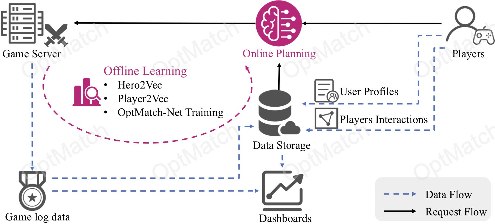
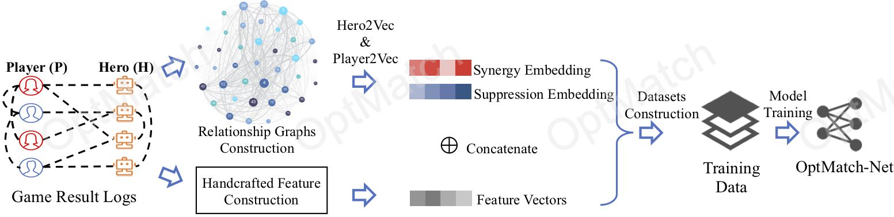
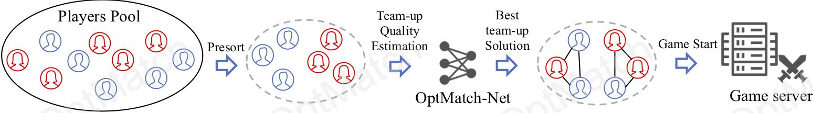

# 1. Introduction
> Authors: 
> <br>[@LinxiaGong(巩琳霞)](https://linxiagong.github.io/), @XiaochuanFeng(冯小川), @DezhiYe(叶徳志)\*, @LiHao(李浩)
> <br>@RunzeWu(吴润泽), @JianrongTao(陶建容), @ChangjieFan(范长杰), @PengCui(崔鹏)
> <br><small>\*The work was done during the internship.</small>

<strong>Keywords: Game Matchmaking, Graph Embedding</strong>

## Long Story Short  

This paper gives:

1. An generalized iterative two stage data-driven matchmaking framework, namely [OptMatch](#21-system-overview), which has minimal product knowledge and data required, by utilizing only win/lose/score results of matches;

2. [(stage 1) offline learning:](#22-offline-learning)
- extracts two interpersonal relations for representing and understanding tacit coordination interactions among players;
- learns the representation vectors to incorporate the high-order interactions;
- trains a model(i.e., OptMatch-Net) to encode team-up effect and predict the match outcome;

3. [(stage 2) online planning:](#23-online-planning)
- leverages the representation vectors of players and OptMatch-Net model to maximize the (predicted) gross utilities for the queuing players

Advantages: 
- applicable to most of gaming products, fast and easy to implement
- minimal knowledge about the products and data required
- robust to data shifting

Limitations:

# 2. Matchmaking System: OptMatch
## 2.1 System Overview


## 2.2 Offline Learning

### 2.2.1 Relationship Mining

### 2.2.2 OptMatch-Net

## 2.3 Online Planning



# 3. Experiments Details (Updating)
## 3.1 Datasets
[>> View the details and analysis of the datasets](./data_analysis/)
or view the detail page of the dataset through the dataset name (in the following table).

| Dataset        | Matches          | Heroes | Players |
|:-------------|------------------:|------:|------:|
| Dota2 (5v5)      | 50,000 | 113 | 10,815  |
|[LOL](./data_analysis/lol/)| 623,263 | 145 | / |
| LOL Championship (5v5) | 187,588   | 139 | 43,706  |
| NBA           | 3,342      | / | 949   |
| Industrial Dataset           | 851,648 | 40 | 33,873  |

<b>Dataset Split:</b>
Matches are sorted by the time for each dataset. Then we take the first 80% matches as the training set and the remaining 20% matches as the test set.
<em><b>Why?</b></em> This ensures no leak of result information from the test set.

## 3.2 Codes structure

```
src
├── data_analysis
├── experiments
├── graph_embedding
│   └── ge_optmatch.py
├── models
│   └── optMatch-Net.py
├── requirements.txt
└── utils
```

## 3.3 Experiment Example
